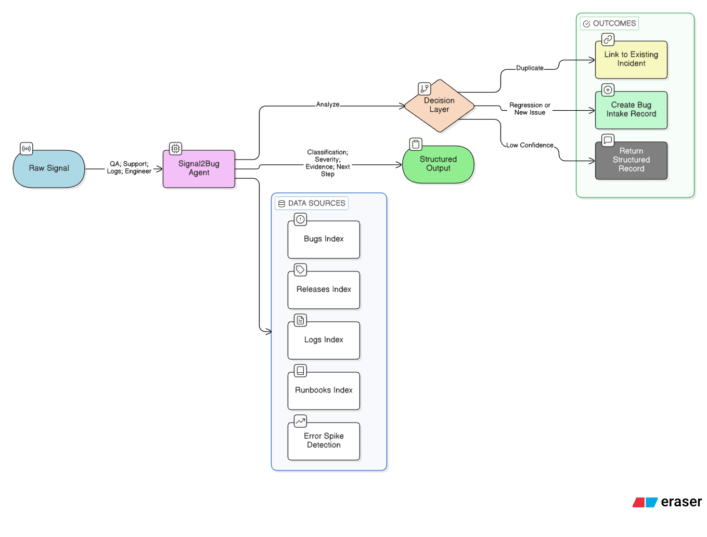
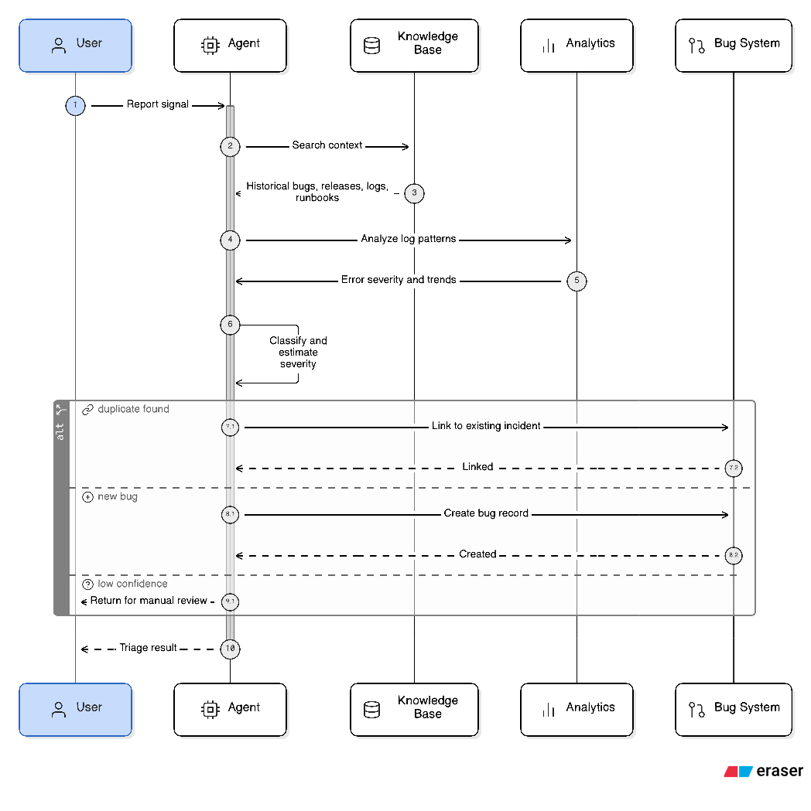

# Signal2Bug

**Signal2Bug** is a tool-driven [Elastic Agent Builder](https://www.elastic.co/docs/explore-analyze/ai-features/elastic-agent-builder) project that turns noisy post-release signals into structured, evidence-backed bug intake decisions.

In a typical software delivery workflow, new defects often arrive as incomplete or noisy signals from QA, support, logs, or engineers. Before engineering teams can act, those signals usually need to be normalized, checked against recent deployments, compared with historical incidents, and rewritten into a structured bug record. This makes post-release triage slow, repetitive, and error-prone, especially when duplicate reports and missing context delay incident response.

Signal2Bug solves this by combining retrieval, structured analysis, and controlled actions in a single agent workflow. It searches historical incidents, releases, logs, and runbooks to gather the right context, uses [Index search tools](https://www.elastic.co/docs/explore-analyze/ai-features/agent-builder/tools/index-search-tools) and [ES|QL tools](https://www.elastic.co/docs/explore-analyze/ai-features/agent-builder/tools/esql-tools) to validate measurable post-release patterns, and uses external [MCP tools](https://www.elastic.co/docs/explore-analyze/ai-features/agent-builder/tools/mcp-tools) to create or link records only when confidence is high enough for a safe action.

The agent runs as a [custom agent](https://www.elastic.co/docs/explore-analyze/ai-features/agent-builder/custom-agents) inside Elastic Agent Builder and works over focused Elasticsearch indices for bugs, releases, logs, and runbooks. It retrieves relevant context, validates log evidence, and then chooses the safest outcome: link the signal to an existing incident, create a new structured bug intake record, or fall back to chat-only output when confidence is not high enough.



At runtime, the flow is simple: the agent first gathers context from its retrieval tools, then validates the signal through structured analysis, and finally selects the safest next action based on confidence and duplicate detection.



## Repository Layout

```text
signal2bug/
├── README.md
├── LICENSE
├── requirements.txt
├── .gitignore
├── app/
│   ├── mcp_server.py
│   └── setup_data.py
├── data/
│   ├── bugs.json
│   ├── releases.json
│   ├── logs.json
│   ├── runbooks.json
│   └── bug_intake_records.json
├── kibana/
│   └── create_indices.http
├── prompts/
│   └── system_prompt.md
└── docs/
    ├── architecture.png
    └── runtime_process.png
```
## Elastic Documentation

If you want to explore the Elastic features used in this project, these are the most relevant official docs:

- [Elastic Agent Builder overview](https://www.elastic.co/docs/explore-analyze/ai-features/elastic-agent-builder)
- [Get started with Elastic Agent Builder](https://www.elastic.co/docs/explore-analyze/ai-features/agent-builder/get-started)
- [Create and manage custom agents](https://www.elastic.co/docs/explore-analyze/ai-features/agent-builder/custom-agents)
- [Tools in Elastic Agent Builder](https://www.elastic.co/docs/explore-analyze/ai-features/agent-builder/tools)
- [Index search tools](https://www.elastic.co/docs/explore-analyze/ai-features/agent-builder/tools/index-search-tools)
- [ES|QL tools](https://www.elastic.co/docs/explore-analyze/ai-features/agent-builder/tools/esql-tools)
- [MCP tools](https://www.elastic.co/docs/explore-analyze/ai-features/agent-builder/tools/mcp-tools)
- [MCP connector](https://www.elastic.co/docs/reference/kibana/connectors-kibana/mcp-action-type)

# Setup

## 1. Install dependencies

```bash
python3 -m pip install -r requirements.txt
```
This installs the Elasticsearch client and FastMCP. FastMCP supports running servers locally for development and can also be exposed over HTTP for remote access.  

## 2. Create indices and load sample data

You have two ways to prepare the data layer.

### Option A — use the Python setup script

Use the Python setup script included in the project (for example `app/setup_signal2bug_stack.py`; if your repo uses `app/setup_data.py`, run that file instead).

First, set your Elasticsearch connection variables:

```bash
export ELASTIC_URL='https://your-elasticsearch-endpoint:443'
export ELASTIC_API_KEY='your_elasticsearch_api_key'
```

Then run the setup script:

```bash
python3 app/setup_signal2bug_stack.py
```

This will create the required indices and load the sample data used by the agent workflow.

At minimum, you should end up with these indices:

- `bugs`
- `releases`
- `logs`
- `runbooks`
- `bug_intake_records`

It should also apply the mappings needed for search, filtering, and structured record storage.

### Option B — use Kibana Dev Tools

If you prefer to create the indices manually, open:

**Kibana → Dev Tools → Console**

Then paste the contents of:

- `kibana/create_indices.http`

and run the requests.

If your HTTP file includes bulk sample data requests, this can also load the example documents. If it only creates the indices, then load the sample data separately afterward.

### Verify that the data is available

After setup, verify the index counts in Kibana Dev Tools:

```http
GET bugs/_count
GET releases/_count
GET logs/_count
GET runbooks/_count
GET bug_intake_records/_count
```

The first four indices should contain sample data.  
`bug_intake_records` may be empty initially, which is expected if no MCP write action has run yet.

This step matters because Agent Builder works best when the relevant operational context is already indexed in Elasticsearch. Without indexed data, the agent would fall back to LLM-only reasoning instead of retrieval-backed analysis.

---

## 3. Run the MCP server locally

Next, start the MCP server that acts as the external action layer for safe persistence.

Set the runtime variable for the destination index:

```bash
export BUG_RECORD_INDEX='bug_intake_records'
```

If your MCP server writes directly into Elasticsearch, make sure `ELASTIC_URL` and `ELASTIC_API_KEY` are still exported in the same terminal session as well.

Then start the server:

```bash
python3 app/mcp_server.py
```

The MCP server runs locally on port `8000`.

Its MCP endpoint is exposed at:

```text
http://localhost:8000/mcp
```

That `/mcp` path is important.

If you open:

```text
http://localhost:8000/
```

you may see a `404 Not Found`, and that is normal. The MCP transport endpoint is not on `/`; it is on `/mcp`.

In this project, the MCP server exposes the action tools used by the agent, such as:

- `create_bug_intake_record`
- `link_signal_to_existing_incident`

These tools are only called when the agent has enough confidence and the action is safe.

---

## 4. Expose the MCP server with ngrok

Because Kibana in Elastic Cloud cannot call `localhost` on your machine directly, you need to expose the local MCP server through a public URL.

Open a second terminal and run:

```bash
ngrok http 8000
```

ngrok will create a public forwarding URL, for example:

```text
https://your-subdomain.ngrok-free.dev
```

Your actual MCP endpoint is that public URL plus `/mcp`:

```text
https://your-subdomain.ngrok-free.dev/mcp
```

That full URL is what Kibana will use when calling the MCP server.

### Important note about testing

A plain browser request to the ngrok URL may not be very informative, and a raw request to `/mcp` may return a protocol-specific response because MCP uses its own HTTP interaction pattern.

What matters is:

- the server is running locally on port `8000`
- ngrok is forwarding traffic to that port
- the public URL ends with `/mcp`

So even if the endpoint does not look “normal” in a browser, the real validation happens when Kibana tests the MCP connector.

---

## 5. Create the MCP connector in Kibana

Once the MCP server is reachable through ngrok, create a connector in Kibana so Agent Builder can access it.

Go to:

**Kibana → Stack Management → Connectors**

Create a new connector with these settings:

- **Type:** `MCP`
- **Server URL:** `https://your-subdomain.ngrok-free.dev/mcp`

Then save the connector.

### After saving

If Kibana provides a test option:

- click **Test**
- then use **List tools** if available

If the connector is working correctly, Kibana should be able to discover the MCP tools exposed by your local server.

This is the bridge between Agent Builder and your external action layer: the agent can reason in chat, and when allowed, it can call the MCP connector to persist a structured bug intake record or link a signal to an existing incident.

---

## 6. Create tools in Agent Builder

Now create the tools the Signal2Bug agent will use for retrieval, analysis, and controlled actions.

Go to:

**Kibana → Agents → Tools → New tool**

Create the following tools.

### 1) `search_bug_reports`

- **Type:** `Index search tool`
- **Index pattern:** `bugs*`

Use this tool to retrieve relevant historical bug reports, similar incidents, ownership patterns, and known issue history.

### 2) `search_releases`

- **Type:** `Index search tool`
- **Index pattern:** `releases*`

Use this tool to check recent deployment context, release timing, impacted services, and version metadata.

### 3) `search_app_logs`

- **Type:** `Index search tool`
- **Index pattern:** `logs*`

Use this tool for direct retrieval over operational log entries when the agent needs supporting evidence from raw or indexed log data.

### 4) `search_runbooks`

- **Type:** `Index search tool`
- **Index pattern:** `runbooks*`

Use this tool to retrieve operational guidance, known mitigation steps, and documented triage procedures.

### 5) `detect_error_spike`

- **Type:** `ES|QL tool`

This tool is used for structured analysis over logs to determine whether there is a measurable post-release error spike.

Use the following ES|QL query:

```sql
FROM logs
| WHERE status_code >= 500
| STATS
    total_errors = SUM(count),
    avg_error_rate = AVG(error_rate_percent),
    max_latency = MAX(latency_ms),
    affected_events = COUNT(*)
  BY service, endpoint, release_version, environment
| SORT total_errors DESC
| LIMIT 10
```

This query helps the agent summarize:

- which services are most affected
- which endpoints show the strongest failure pattern
- which release version is associated with the spike
- which environment is impacted

### 6) `create_bug_intake_record`

- **Type:** `MCP tool`

When creating this tool:

- choose the MCP connector you created in Step 5
- select the discovered tool: `create_bug_intake_record`

This tool is used when the signal is classified as a likely new issue or regression, confidence is high, and no active duplicate exists.

### 7) `link_signal_to_existing_incident`

- **Type:** `MCP tool`

When creating this tool:

- choose the same MCP connector
- select the discovered tool: `link_signal_to_existing_incident`

This tool is used when the agent determines that the incoming signal matches an already active incident and should be linked instead of creating a duplicate intake record.

### Result

After these tools are created, your agent will have:

- **retrieval tools** for bugs, releases, logs, and runbooks
- **structured analysis tools** for validating error spikes
- **external action tools** for safe persistence through MCP

At that point, the tool layer is ready and you can attach these tools to your custom Signal2Bug agent in Agent Builder.

## Demo Prompts

Use the following prompts in the agent chat to validate the full Signal2Bug workflow.

### Demo 1 — Duplicate (should link, not create)

Use this prompt:

> After release 2.4.1, multiple users report that checkout freezes after clicking Pay, and some sessions return HTTP 500 errors in production. The issue started shortly after deployment. Please search historical incidents, check release context, validate log evidence, and determine whether this signal is a regression, duplicate, new issue, or needs manual review. If it matches an active incident, do not create a new record. Link this signal to the existing incident instead and explain why.

Expected outcome:

- finds an active incident
- classification = `Duplicate`
- calls `link_signal_to_existing_incident` tool

### Demo 2 — New issue / regression (should create)

Use this prompt:

> After the latest production release, users report that the saved card selector disappears on the checkout page before payment submission. No matching HTTP 500 error was explicitly reported, but affected users cannot complete payment with stored cards. Search incidents, releases, logs, and runbooks to determine whether this is a duplicate, regression, new issue, or manual review case. If no active duplicate exists and confidence is high, create a structured bug intake record.

Expected outcome:

- no active duplicate
- classification = `New issue` or `Regression`
- calls `create_bug_intake_record` tool

### Demo 3 — Weak signal (should not persist)

Use this prompt:

> A QA note says: “Checkout seemed slower after the release, and one payment test failed, but we do not yet have exact reproduction steps, logs, or affected endpoint details.” Search for supporting evidence in incidents, releases, logs, and runbooks. If evidence is insufficient or conflicting, do not take any external action. Return a cautious triage result, a structured bug intake record in chat only, and clearly list what information is still missing.

Expected outcome:

- low confidence
- no MCP tool call
- chat-only structured output